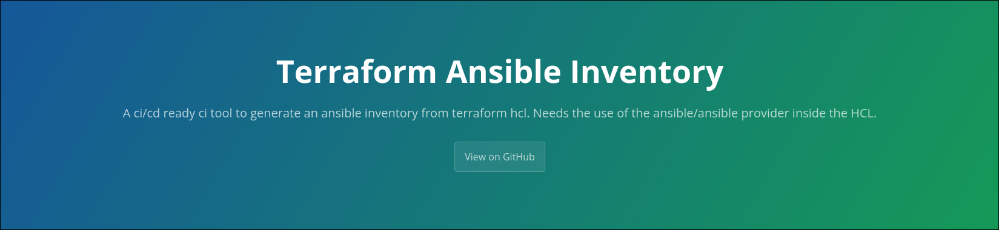

# terraform-ansible-inventory CLI

<p align="center">



</p>


A high-performance, zero-dependency Go command-line tool for building complete Ansible inventories from Terraform state generated by the `ansible/ansible` provider.

Detailed documentation is available in the [docs directory](docs/) and on the [GitHub Pages](https://hilkopterbob.github.io/terraform-ansible-inventory/) site.

The tool expects your Terraform configuration to use the `ansible/ansible` provider so that hosts, groups and variables are written to the state file.

RedHat's official inventory plugin struggles with nested modules and often misses resources. This CLI parses the state directly and fully supports child modules so you can reliably generate inventories from complex configurations.

---

## 🔍 Features

- **Streaming JSON parsing** for huge state files without high memory use using the `jstream` library.
 - **Multiple output formats**: `yaml`, `ini`, and `json`.
- **Understands provider resources** including host variables and group hierarchy.
- **Child module aware** so nested modules are fully traversed.
- **Built-in IP/CIDR handling** for `ansible_host` variables.
- **Clean CLI interface** with automatic `--help` and sensible defaults.
- **Zero dependencies** aside from the Go runtime.
- **CI ready** with smoke test data and GitHub Actions workflow.
- **Docker image verified** in CI to match the native binary.
- Filter output by host or group using `--host` and `--group` flags.

---

## 📦 Installation

```bash
# Clone the repo:
git clone https://github.com/HilkopterBob/terraform-ansible-inventory.git
cd terraform-ansible-inventory

# Build the binary:
go build -o terraform-ansible-inventory ./main.go

# (Optional) Install globally:
go install github.com/HilkopterBob/terraform-ansible-inventory@latest

# Or download a ready-made binary from the
[releases page](https://github.com/HilkopterBob/terraform-ansible-inventory/releases).
```

### Docker image

Two container images are published for each release on
[GitHub Container Registry](https://ghcr.io).
`terraform-ansible-inventory` is a minimal runtime image while the `-tf` variant
also bundles the latest Terraform binary. Use the latter when you need to pull
state from remote backends.

```bash
# minimal image
docker run --rm ghcr.io/hilkopterbob/terraform-ansible-inventory:latest --help

# with Terraform installed
docker run --rm ghcr.io/hilkopterbob/terraform-ansible-inventory:latest-tf terraform version
```

In GitLab CI you must override the image entrypoint so the pipeline script can
run:

```yaml
image:
  name: ghcr.io/hilkopterbob/terraform-ansible-inventory:latest
  entrypoint: [""]

generate-inventory:
  script:
    - terraform-ansible-inventory --input tf.json --format yaml > inventory.yaml
```

---

## 🚀 Usage

```
$ terraform-ansible-inventory --help
Usage of terraform-ansible-inventory:
  -format string
        Output format: yaml, ini, json (default "yaml")
  -input string
        Path to input JSON file (or '-' for stdin)
```

All flags can be abbreviated:

- `-i` or `--input`
- `-f` or `--format`

### Examples

Assume `state.json` is your Terraform state created with the `ansible/ansible` provider:

```bash
# 1) YAML inventory
terraform-ansible-inventory -i state.json -f yaml > inventory.yml

# 2) INI inventory
terraform-ansible-inventory -i state.json -f ini > inventory.ini

# 3) JSON machine readable form
terraform-ansible-inventory -i state.json -f json > inventory.json
```

### Example HCL and Generated Inventory

Below is a minimal Terraform snippet using the `ansible/ansible` provider.
It defines one inventory-level variable, a group and a single host:

```hcl
resource "ansible_inventory" "default" {
  variables = {
    env = "prod"
  }
}

resource "ansible_group" "web" {
  name = "web"
  variables = {
    tier = "frontend"
  }
}

resource "ansible_host" "test1" {
  name   = "test1"
  groups = [ansible_group.web.name]
  variables = {
    ip = "192.168.1.10"
    os = "linux"
  }
}
```

Running the CLI against the resulting state produces different inventory formats.

**YAML**

```yaml
all:
  vars:
    env: prod
  children:
    web:
      hosts:
        test1:
          ansible_host: 192.168.1.10
          os: linux
      vars:
        tier: frontend
```

**INI**

```ini
[all]

[all:vars]
env=prod

[web]
test1 ansible_host=192.168.1.10 os=linux

[web:vars]
tier=frontend
```

**JSON**

```json
{
  "Hosts": {
    "test1": {
      "Name": "test1",
      "Variables": {
        "ip": "192.168.1.10",
        "os": "linux"
      },
      "Groups": ["web"],
      "Enabled": true,
      "Metadata": {}
    }
  },
  "Groups": {
    "web": {
      "Name": "web",
      "Variables": {"tier": "frontend"},
      "Children": null,
      "Hosts": ["test1"],
      "Parents": null
    }
  },
  "Vars": {"env": "prod"}
}
```


## 🔧 Contributing

1. Fork & clone the repo
2. Create a feature branch `git checkout -b feature/myfeature`
3. Add tests under `internal/*_test.go`
4. Ensure all tests pass
5. Optionally build the Docker image and run the smoke test
6. Submit a PR

---

## 📄 License

Apache-2.0 © Nick von Podewils

